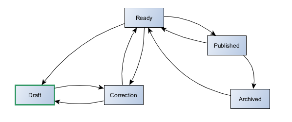
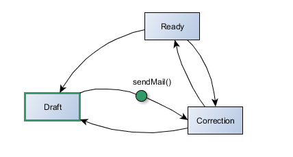

# About Workflows

According to wikipedia :

> A workflow consists of a sequence of connected steps. It is a depiction of a sequence of operations, declared 
as work of a person, a group of persons, an organization of staff, or one or more simple or complex mechanisms. 
Workflow may be seen as any abstraction of real work, segregated in workshare, work split or other types of ordering. 
For control purposes, workflow may be a view on real work under a chosen aspect, thus serving as a virtual 
representation of actual work. 

> (*[read more on Wikipedia](http://en.wikipedia.org/wiki/Workflow)*)

Workflows (also called Petri net) is a vast subject and the aim of this document is not to go deeply in the theorical fields. 
As described in the next chapter, the SimpleWorkflow behavior only implements a simple subset of it.  if you are intrested in 
better understanding theorical basis on the subject, you'll find some [references](#references) at the end of this page. 


## Use case : a blog

To demonstrate how the workflow concept can be used in a valuable way, let's consider a real life example : a Blog. 
In a typical blog webapp, you would find a model for Post with a *status* attribute that accept 3 values defined
as class constants.

*models/Post.php*	
```php
class Post extends \yii\db\ActiveRecord
{
    const STATUS_DRAFT=1;
    const STATUS_PUBLISHED=2;
    const STATUS_ARCHIVED=3;
```

It is quite obvious that theses values define possible states of a Post instance. Moreover, a set of rules are used to 
define how posts will evolve among these 3 statuses : when you first create a post, it is defined as being *draft*, 
then it can be *published* or *archived*. A *published* post can become *draft* (it is then unpublished) or be *archived*. 
At last an *archived* post can be *published* or become *draft*.

What we have just described here are allowed transitions between different statuses of the Post, and if we try to give 
a graphical representation to this description, we'll end up with our first (and very simple) workflow. 


Out workflow definition is:

- 3 statuses : draft, published, archived
- 6 possible transitions
- initial status : draft

To handle this very simple workflow, there is not much to do as the user has complete freedom to set a post status : any 
status can be reached from any other status and in this case, *there is no need** for a dedicated extension that would 
handle workflow logic.

## Use case²: a multi-user publishing system

Let's imagine something a little bit more complex.

> Our basic blog is now becoming a multi-user publishing system, where each user is assigned tasks : some are redactors (reporter), 
some make corrections and layout work (they know css), and there is of course some chief editors who are responsible for publication.

If we want to be able to handle posts in our new publishing system, we must think of a more elaborated workflow that will fit this 
new organisation. First of all, let's list possible post statuses : 

- **draft** : when created, a post is always draft. This is the *initial status* of all Posts
- **correction** : the post is being corrected and layout improvements may also be added
- **ready** : the post is ready to be published but not yet online
- **published** : the post is online, available to readers
- **archived** : the post is not directly available to readers, but can be accessed through the archive section of the site

That is not enough. Now we must define possible transitions between these statuses. These transitions strongly depend on how 
the work is going to be organized, how users of our publishing system will interact with each other. For this example we 
will abritrarly state following rules : 

1. A Post must always be corrected before publication
2. the chief editor is responsible for publishing/unpublishing posts
3. the chief editor is responsible for sending a post to archive

That will be enough for this example but of course we could (and probably should) add more business rules.
Now, based on what we have just define, here is the Post workflow : 



The first version of the Post worfklow was very simple, and as each status could reach any other status, there was no need for 
the developper to make any tests when a Post changed status. With this last version above, that's another story ! Some logic must 
be implemented in order to prevent *Archived* post to become *Draft*, or *Published* posts to be sent to *Correction*. 

That is when the *SimpleWorkflow*  behavior is useful!

### Workflow Definition

So we have a nice workflow, let's see how the *SimpleWorkflowBehavior* can help in managing our Post models life-cycle inside this workflow.
First we must create a definition for our workflow. 

A Workflow can be defined as a PHP class that contains the method `getDefinition()`. This method returns as PHP array which is the 
workflow definition.

The class is named **PostWorkflow** which is by convention the name of a workflow associated with the *Post* model. It is located in
`@app/models`, the default location where workflow definitions are stored. Note that these conventions and default settings 
can of course be overloaded with values provided by the developer at initialisation (this will be discussed later).

```php
namespace app\models;

class PostWorkflow implements \raoul2000\workflow\base\IWorkflowDefinitionProvider 
{
	public function getDefinition() {
		return [ 
			'initialStatusId' => 'draft',
			'status' => [
				'draft' => [
					'transition' => ['correction']
				],
				'correction' => [
					'transition' => ['draft','ready']
				],
				'ready' => [
					'transition' => ['draft', 'correction', 'published']
				],
				'published' => [
					'transition' => ['ready', 'archived']
				],
				'archived' => [
					'transition' => ['ready']
				]
			]
		];
	}
}
``` 

A more condensed format is also supported, but for this example we will use this one as it allows more customization.

## Attaching the behavior

To be able to manage our Post model inside the workflow, we must take care about following points :
- *check that our model inherits from* ActiveRecord : the *SimpleWorkflowBehavior* can only be attached to ActiveRecord objets.
- add an attribute that will be used to store the current status of a post. We will use attribute 'status' with type VARCHAR(40) for
our example, but it can be any attribute.

*Post.php in @app/models*
```php
<?php

namespace app\models;
/**
 * @property integer $id
 * @property string $title
 * @property string $body
 * @property string $status column used to store the status of the post
 */
class Post extends \yii\db\ActiveRecord
{
    public function behaviors()
    {
    	return [
			\raoul2000\workflow\base\SimpleWorkflowBehavior::className()
    	];
    }
    // ...
```

## Basic Status Usage 
 
### Assignement and Initial Status

The first operation you'll probably need to perform is assigning a status to your model. The natural way to do this is by simply
assigning a value to the *status* attribute.

```php
$post = new Post();
$post->status = 'published';
```

When you assign a value to the 'status' attribute, no verification is done against the workflow and the *SimpleWorkflowBehavior* is
not event invoked in any way. **The status validation occurs only when the status assignement is saved** : at this time only the
post object is considered as really sent to a specific status.

The status validation consists in verifying that the model can perform the transition between its current status and the assigned status.

Let's consider the following code : 

```php
$post = new Post();
$post->status = 'published';
$post->save();
```

When we run this code, we get an Exception !

	Workflow Exception – raoul2000\workflow\base\WorkflowException
	Not an initial status : PostWorkflow/published ("PostWorkflow/draft" expected)
	
Could it be more clear ? Ok, maybe it could. Let's see in detail what just happened. 

The *SimpleWorkflowBehavior* enters in action when the Post is saved. At this point it tests if the transitions is possible
bewteen the original status and the final one. In our case, there was no original status (the object has just been created) and the final
status has been set to 'published'. So, from the *SimpleWorkflowBehavior* point of view, we are dealing with the following transition : 

	null -> 'published'
	
This transition is particular as it happens **only when a model enters into a workflow**. If you remember well, the *PostWorkflow* definition 
above contained a key called *initialStatusId*. This key is used to define the status Id that must be used by any model when entering a workflow. 
Obviously we didn't comply with this rule as we tried to enter through the 'published' status and that's why we get a self explanatory
exception advising us to use *PostWorkflow/draft* instead.

Let's follow this wise advice :
 
```php
$post = new Post();
$post->status = 'draft';
$post->save();
echo 'the status is : ' . $post->status;
```

Now our post is saved correctly and the output is. 

```
the status is : PostWorkflow/draft 
```

Hey wait ! what's that ? we set the *status* to 'draft', saved to post and now the value of our status attribute is *PostWorkflow/draft*. All
right, don't panic, this is just the way the *SimpleWorkflowBehavior* normalized the status id, from its short form (*draft*)
to its absolute form (*PostWorkflow/draft*). We will describe this later in a chapter dedicated to the *WorkflowSource* component.
For the moment just remember that these 2 forms of writting a status are equivalent.


### sendToStatus

Another way of assigning a status to our Post model is by using the method *sendToStatus()* provided by the *SimpleWorkflowBehavrior*. 
When you use *sendToStatus()* it is not required to save the model for the *SimpleWorkflowBehavrior* to enter in action. A call to
*sendToStatus()* will perform following tasks :

- retrieve the current status value
- find a transition between the current status and the one passed as argument
- if such a transition exists, ensure that it can be used, that it is valid
- on success, apply the transition and update the *status* attribute owned by the Post model 

**_sendToStatus()_ actually performs the transition : the model leaves it current status and goes to the new one.** It is equivalent
to status attribute assignement and model being saved.

In the example below, the output is the same as before, without having to invoke *save()*.

```php
$post = new Post();
$post->sendToStatus('draft');
echo 'the status is : ' . $post->status;
```

And of course if we try to break the initial status rule again, we will also get the same exception as before.

```php
$post = new Post();
$post->sendToStatus('published');	// exception is thrown here !
```


### Summary

The *SimpleWorkflowBehavior* maintains internally the *real* value of the current status. To actually change the status of a model 
you have two options :

- assign a value to the 'status' attribute and save (or update) it
- call  *sendToStatus()* with the end status as argument


## Getting the Status

If status assignement can be done by assigning a value to the *status* attribute, getting the status value of a model should not involve
accessing this attribute directly but use the method *getWorkflowStatus()* instead. However in certain circumstances, reading the 
status attribute value is acceptable but then it is your responsability to ensure that both values are synchronized.

### getWorkflowStatus() vs attribute

When you call *getWorkflowStatus()* on a model attached to the *SimpleWorkflowBehavior*, you will retrieve the instance of the current 
status your model is currently in. The type of the object returned in this case is *\raoul2000\workflow\base\Status*. If your model is
not in a workflow, *getWorkflowStatus()* returns NULL.


```php
// first save a post in status 'draft' 
$post = new Post();
$post->sendToStatus('draft');
$post->save();

// now read this post and output its status label
$post2 = Post::findOne($post->id);
echo '(1) the status is : ' . $post2->getWorkflowStatus()->getId();
echo '(2) the status is : ' . $post2->status;
```

The output is :

	(1) the status is : PostWorkflow/draft 
	(2) the status is : PostWorkflow/draft 
	
Seeing at this result, it is not obvious why we should use the *getWorkflowStatus()* method instead of direct attribute access to get
the status of a model. Ok but remember that the status attribute may not contain the actual value of the model's status, until this model is 
saved (or updated). 

Let's see that on an example. In the code below, 2 functions are modifying and returning a newly created Post object. The problem
is they are both accessing the status attribute assuming it contains the actual Status value of the post. 

```php
function foo($post) {
	// do some fancy stuff here ...
	if( $post->status == null) {
		$post->status = 'draft';
	}
	return $post;
}

function bar($post) {
	// do even more some fancy stuff here ...
	if( $post->status == 'draft'){
		$post->status = 'correction';
	}
	return $post;
}

$post = foo(new Post());
$post = bar($post);
$post->save();	// keep the faith
```

Can you guess what happens when *save()* is called ?  Well, that's when the *SimpleWorkflowBehavior* enter into action, but that's too late.. 
The value of the status attribute is 'correction' and the *real* status value stored internally by the behavior is NULL. From the 
*SimpleWorkflowBehavior* point of view, this post object is trying to enter into a workflow through the 'correction' status 
and we know this is not permitted : bang ! Same exception again ! 

	Workflow Exception – raoul2000\workflow\base\WorkflowException
	Not an initial status : PostWorkflow/published ("PostWorkflow/draft" expected) 

This small example tries to illustrate the danger of using the status attribute to know the actual status of the object. Very much care should 
be taken when doing this and remember that **the value of the status attribute does not always reflect the actual Status of a model**.

Below is a safe version of the previous example. All access are done through the *SimpleWorkflowBehavior* behavior. 

```php
function foo($post) {
	// test if $post is currently in a workflow
	if( ! $post->hasWorkflowStatus() ) {
		$post->sendToStatus('draft');
	}
	return $post;
}

function bar($post) {
	// note that we use the absolute form of the status Id
	if( $post->getWorkflowStatus()->getId() == 'PostWorkflow/draft'){
		$post->sendToStatus('correction');
	}
	return $post;
}

$post = foo(new Post());
$post = bar($post);
$post->save();
```

That being said, if you know what you are doing you can of course use the 'status' attribute directly to perform some operations. In this
case remember that when the 'status' value is set by the *SimpleWorkflowBehavior* the absolute form of status id is used.
 
## Workflow Tasks

Being able to garantee that the model status will only use authorized transition is nice, but the *SimpleWorkflowBehavior*  
provides a way to add some logic to worfklows.

Let's imagine that we want to improve our Publhsing System with this new business rule : 

>We have noticed that people in charge of correction are not so reactive, which increases the publication delay. 
They say it's because they never know when a new post is ready to be corrected and so, we decide to improve our Blog by sending an email 
to all correctors, as soon as a new post is requesting correction.
 
This can be achieved very easely by adding a **task** to our workflow, on the transition that goes from the *draft* status
to the *correction* status. In the (incomplete) workflow representation below, this task is symbolized by a little green 
square attached to the transition.

 

Let's see how to implement this *sendMail()* task we need to improve our Publishing System :

*@app/models/Post.php*

```php
use raoul2000\workflow\events\WorkflowEvent;

class Post extends \yii\db\ActiveRecord
{
	public function init()
	{
		$this->on(
			WorkflowEvent::afterChangeStatus('PostWorkflow/draft', 'PostWorkflow/correction'), 
			[$this, 'sendMail']
		);
	}	
	
	public function sendMail($event) 
	{
		MailingService::sendMailToCorrector(
			'A Post is ready for correction',
			'The post [' . $event->sender->owner->title . '] is ready to be corrected.'
		);		
	}
```

If you know a little bit about *Events* in Yii2, you may have recognized what happens on the *init()* method of our Post model : we 
have attached an event handler to the event returned by the call to *WorkflowEvent::afterChangeStatus('PostWorkflow/draft', 'PostWorkflow/correction')*
which is nothing more than a helper method that creates the actual event name for you.

If you're not familiar with the concept of Event in Yii2, you can have a look to 
the [Yii2 definitive Guide](http://www.yiiframework.com/doc-2.0/guide-concept-events.html).

### The Event Model

The *SimpleWorkflowBehavior* is built around Yii2 events. Most of the time when something intresting happens in a workflow, an event is fired, and that's
your job to decide what to do : catch it and use it or let it go, let it free, [let it be](https://youtu.be/ajCYQL8ouqw).

There are workflow events for almost everything :

- when a model enters in a workflow
- when a model leaves a workflow
- when a model enters in a status
- when a model leaves a status

For even more control, each event from the above list is splitted its *before* and *after* subtype. When working with events, it is important to
understand when each one is fired so to choose the appropriate one to perform a task. In the previous example we have
declared an *event handler* in charge of sending a mail to the corrector people, when the post changes from status 'draft' to 'correction'. That's already
something, but it doesn't completely satisfies our requirement which was :
 
> [...] sending an email to all correctors, as soon as a new post is requesting correction.

If we take a look to our workflow, we can see that there are 2 ways to reach the status 'correction' : one coming from 'draft' the 
other coming from from 'ready'... and this one is not taken into account by the current event handler installed the the Post model.
 
We could of course handle both transitions, but what if tomorrow, a new transition to 'correction' is added ? To be sure to still notify correctors, the
proper solution would be to handle the 'enter to status' event. 


The event registration now becomes : 

```php
$this->on(
	WorkflowEvent::afterEnterStatus('PostWorkflow/correction'),
	[$this, 'sendMail']
);
```

The *sendMail()* method will be invoked each time a post model enter into the status 'correction', and no matters where it comes from. 

There's more than that and events in *SimpleWorkflowBehavior* is a vas subject that is covered in detailed in [another chapter](events.md). 
   

 


## <a name="references"></a>References

The SimpleWorkflow behavior, is not dedicated to provide a complete workflow driven model that would replace MVC or any other pattern. 
It should only be considered as a set of tools that facilitate workflow managment for simple applications. 

If you want to know more about the subject, and discover what a complete workflow engine looks like, here is a list of 
intresting links.

- [An activity based Workflow Engine for PHP](http://www.tonymarston.net/php-mysql/workflow.html)
- [Workflow Patterns home page](http://www.workflowpatterns.com/)
- [Galaxia : an open source workflow engine](http://workflow.tikiwiki.org/tiki-index.php?page=homepage)
- [ezComponent : workflow](http://www.ezcomponents.org/docs/api/latest/introduction_Workflow.html)

